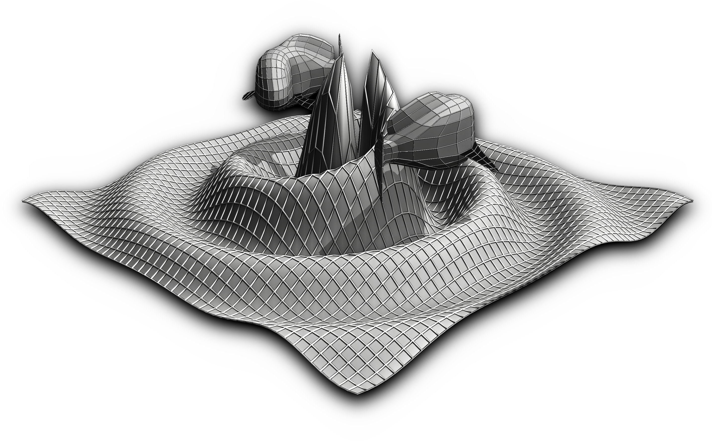

=================================
GWDALI Software
=================================

Software developed to perform parameter estimations of gravitational waves from compact objects coalescence (CBC) via Gaussian and Beyond-Gaussian approximation of GW likelihood. The Gaussian approximation is related to Fisher Matrix, from which it is direct to compute the covariance matrix by inverting the Fisher Matrix **[1]**. GWDALI also deals with the not-so-infrequent cases of Fisher Matrix with zero-determinant. The Beyond-Gaussian approach uses the `Derivative Approximation for LIkelihoods <https://arxiv.org/abs/1401.6892>`_ (DALI) algorithm proposed in **[2]** and applied to gravitational waves in **[3]**, whose model parameter uncertainties are estimated via Monte Carlo sampling but less costly than using the GW likelihood with no approximation.

Installation
---------

To install the software run the command below:

.. code-block:: console

    $ pip install gwdali

Usage [example]
---------

.. code:: python

	import numpy as np
	#-------------------
	import GWDALI as gw
	#-------------------
	from tqdm import trange
	from astropy.cosmology import FlatLambdaCDM
	cosmo = FlatLambdaCDM(70,0.3)

	rad = np.pi/180 ; deg = 1./rad
	#--------------------------------------------
	# Detector, position and orientation
	#--------------------------------------------
	FreeParams = ['DL','iota','psi','phi_coal']

	# Cosmic Explorer:
	det0 = {"name":"CE","lon":-119,"lat":46,"rot":45,"shape":90}
	# Einstein Telescope:
	det1 = {"name":"ET","lon":10,"lat":43,"rot":0,"shape":60}
	det2 = {"name":"ET","lon":10,"lat":43,"rot":120,"shape":60}
	det3 = {"name":"ET","lon":10,"lat":43,"rot":-120,"shape":60}

	#------------------------------------------------------
	# Setting Injections (Single detection)
	#------------------------------------------------------
	z = 0.1 # Redshift

	params = {}
	params['m1']  = 1.3*(1+z) # mass of the first object [solar mass]
	params['m2']  = 1.5*(1+z) # mass of the second object [solar mass]
	params['z']   = z
	params['RA']       = np.random.uniform(-180,180)
	params['Dec']      = (np.pi/2-np.arccos(np.random.uniform(-1,1)))*deg
	params['DL']       = cosmo.luminosity_distance(z).value/1.e3 # Gpc
	params['iota']     = np.random.uniform(0,np.pi) 	 # Inclination angle (rad)
	params['psi']      = np.random.uniform(-np.pi,np.pi) # Polarization angle (rad)
	params['t_coal']   = 0  # Coalescence time
	params['phi_coal'] = 0  # Coalescence phase
	# Spins:
	params['sx1'] = 0 
	params['sy1'] = 0
	params['sz1'] = 0
	params['sx2'] = 0
	params['sy2'] = 0
	params['sz2'] = 0

	#----------------------------------------------------------------------
	# "approximant" options: 
	#		[Leading_Order, TaylorF2_py, ...] or any lal approximant
	#----------------------------------------------------------------------
	# "dali_method" options:
	#		[Fisher, Fisher_Sampling, Doublet, Triplet, Standard]
	#----------------------------------------------------------------------
	res = gw.GWDALI( Detection_Dict = params, 
			 FreeParams     = FreeParams, 
			 detectors      = [det0,det1,det2,det3], # Einstein Telescope + Cosmic Explorer
			 approximant    = 'TaylorF2_py',
			 dali_method    = 'Doublet',
			 sampler_method = 'nestle', # Same as Bilby sampling method
			 save_fisher    = False,
			 save_cov       = False,
			 plot_corner    = False,
			 save_samples   = False,
			 hide_info      = True,
			 index          = 1,
			 rcond          = 1.e-4,
			 npoints=300) # points for "nested sampling" or steps/walkers for "MCMC"

	Samples = res['Samples']
	Fisher  = res['Fisher']
	CovFish = res['CovFisher']
	Cov     = res['Covariance']
	Rec	= res['Recovery']
	Err     = res['Error']
	SNR     = res['SNR']

=================================  
API
=================================

.. py:function:: GWDALI.GWDALI(Detection_Dict, FreeParams, detectors, approximant='TaylorF2', fmin=1, fmax=1.e4, fsize=3000, dali_method='Fisher_Sampling', sampler_method='nestle', save_fisher=True, save_cov=True, plot_corner=True, save_samples=True, hide_info=False, index=1, rcond=1.e-4, npoints=300)

	Return GW samples, Fisher and covariance matrix, parameters uncertainties, parameters recovered and signal to noise ratio (SNR).

	:param Detection_Dict: A dictionary of GW parameters;
	:param FreeParams: list of free parameters among the available ['m1', 'm2', 'RA', 'Dec', 'DL', 'iota', 'psi', 't_coal', 'phi_coal', 'sx1', 'sy1', 'sz1', 'sx2', 'sy2', 'sz2']
	:param detectors: list of dictionaries for each detector interferometer (for Einstein Telescope you need to specify its three interferometers configuration). Each detector dictionary needs to have the following keys:

		* ``name``: (str) The detector name for which the *Noise Power Spectral Density* will be chosen. Available detectors: ['aLIGO', 'aVirgo', 'KAGRA', 'ET', 'CE'];
		* ``lon``: (float) The detector longitude (degrees);
		* ``lon``: (float) The detector latitude (degrees);
		* ``rot``: (float) X-arm detector orientation starting from North-South direction (degrees);
		* ``shape``: (float) Opening angle between arms interferometer (degrees);

	:param approximant: GW approximant among the available ['Leading_Order', 'TaylorF2'_py, ...] (or another approximant provided by lal). To use the lal approximants you need to have installed `lal/lalsuite <https://lscsoft.docs.ligo.org/lalsuite/lalsuite/index.html>`_ in your machine.
	:param fmin: initial frequency value to the GW signal be evaluated.
	:param fmax: final frequency value to the GW signal be evaluated.
	:param fsize: number of frequency points.
	:param dali_method: DALI method [``'Fisher_Sampling'``, ``'Doublet'``, ``'Triplet'``, ``'Standard'``] or only ``'Fisher'`` for a simple numerical matrix inversion. The 'Standard' method use the complete GW likelihood (with no approximation).
	:param sampler_method: Method used for DALI (the same ones available in `bilby package <https://lscsoft.docs.ligo.org/bilby/>`_)
	:param save_fisher: Save the Fisher Matrix in a file named 'Fisher_Matrix_<index>.txt' where ``index`` is the integer argument bellow
	:param save_cov: Save the Covariance Matrix in a file named 'Covariance_<index>.txt'.
	:param plot_corner: Make a corner plot when using DALI methods.
	:param save_samples: Save GW samples in a file named 'samples_<index>.txt' where each column correspond to the samples of one free parameter specified above;
	:param hide_info: Hide software outputs in the screen.
	:param index: Integer argument used in the saved .txt files.
	:param rcond: Same as rcond in `numpy.linalg.pinv <https://numpy.org/doc/stable/reference/generated/numpy.linalg.pinv.html>`_;
	:param npoints: Same as npoints, nsteps, nwalkers in `bilby package <https://lscsoft.docs.ligo.org/bilby/>`_;
	
	:type Detection_Dict: dict
	:type FreeParams: list
	:type detectors: list
	:type approximant: str
	:type fmin: float
	:type fmax: float
	:type fsize: float
	:type dali_method: str
	:type sampler_method: str
	:type save_fisher: bool
	:type save_cov: bool
	:type plot_corner: bool
	:type save_samples: bool
	:type hide_info: bool
	:type index: int
	:type rcond: float
	:type npoints: int

	:return: Return a dictionary with the following keys

		- ``Samples``: array_like with shape (len(FreeParams) , number of samples points)
	
		- ``Fisher``: array_like with shape (len(FreeParams),len(FreeParams))
	
		- ``CovFisher``: array_like with shape (len(FreeParams),len(FreeParams))
	
		- ``Covariance``: array_like with shape (len(FreeParams),len(FreeParams))
	
		- ``Recovery``: list of recovered parameters (when using DALI methods)
	
		- ``Error``: list of parameters uncertainties (Confidence Level = 60%)
	
		- ``SNR``: value of the GW source signal to noise ratio (float)

=================================  
References
=================================

	**[1]** L. S. Finn and D. F. Chernoff, “Observing binary inspiral in gravitational radiation: One interferometer,” Phys. Rev. D, vol. 47, pp. 2198–2219, 1993.

	**[2]** E. Sellentin, M. Quartin, and L. Amendola, “Breaking the spell of gaussianity: forecasting with higher order fisher matrices,” Monthly Notices of the Royal Astronomical Society, vol. 441, no. 2, pp. 1831–1840, 2014.

	**[3]** Z. Wang, C. Liu, J. Zhao, and L. Shao, “Extending the fisher information matrix in gravitational-wave data analysis,” arXiv preprint arXiv:2203.02670, 2022.

=================================  
About the Author
=================================

* **Josiel Mendonça Soares de Souza**
	* PhD in Physics
	* Departamento de Física Teórica e Experimental, Universidade Federal do Rio Grande do Norte, Rio Grande do Norte, Brazil
	* Research Field: Gravitation, Cosmology and Gravitational Waves
	* `github profile <https://github.com/jmsdsouzaPhD>`_
	* `ORCID <https://orcid.org/0000-0003-1552-0095>`_

Collaborator:

* **Riccardo Sturani**
	* Instituto de Física Teórica (IFT, ICTP-SAIFR), Universidade Estadual Paulista (UNESP), São Paulo, Brazil

=================================
License
=================================

MIT License

