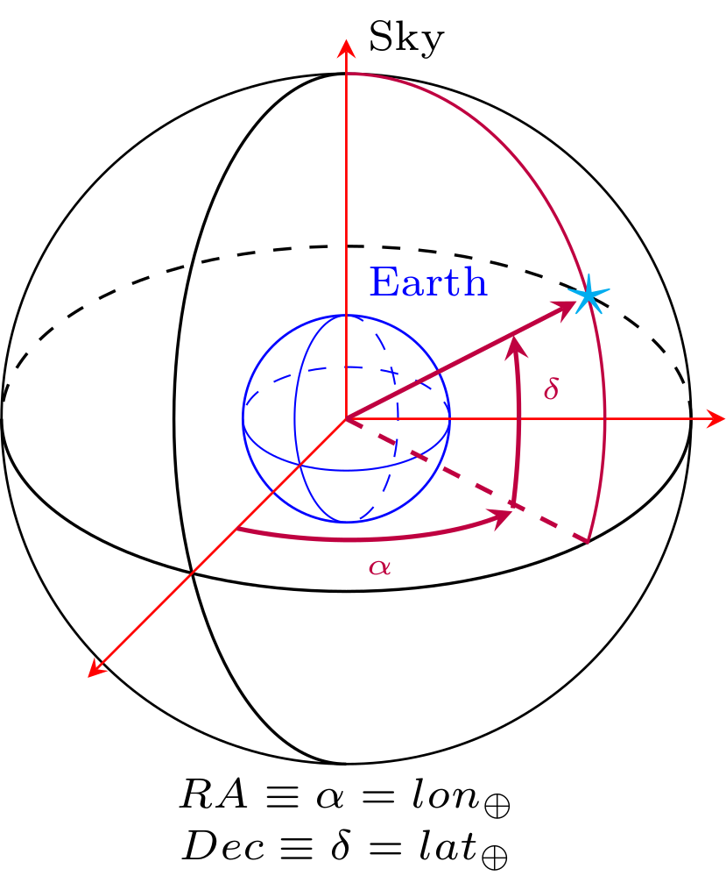

=================================  
GW Sources Characterization
=================================
In GWDALI we deal with astronomical coordinates (RA, Dec) aligned with geocentric coordinates (longitude 'lon' and latitude 'lat' ) such that $RA//lon$ and $Dec//lat$:

