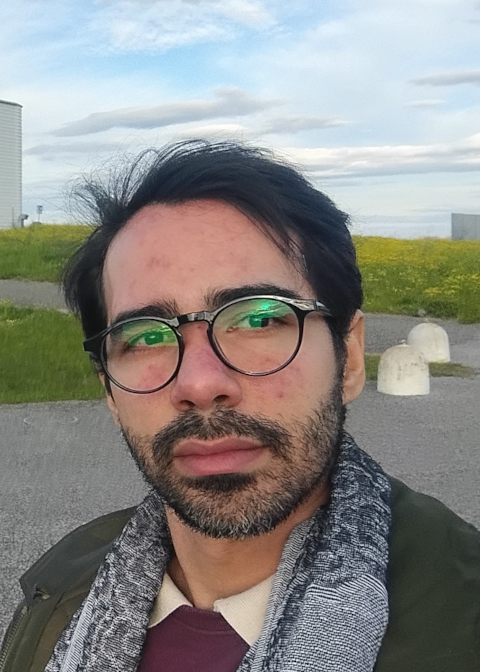

=================================  
About the Author
=================================

* **Dr. Josiel Mendonça Soares de Souza**
	* PostDoc in Physics
	* PPGCosmo, Universidade Federal do Espírito Santo, ES, Brazil
	* Research Field: Gravitation, Cosmology and Gravitational Waves
	* Member of `Brazilian Einstein Telescope Synergy (BETS) <https://indico.ego-gw.it/event/562/sessions/666/attachments/2789/4922/BETS_RU_10_Mai_sturani.pdf>`_
	* Member of `Einstein Telescope Observational Science Board (ET-OSB) <https://www.et-gw.eu/index.php/the-et-collaboration/observational-science-board>`_
	* Member of `Cosmic Explorer Consortium <https://cosmicexplorer.org/consortium.html>`_
	* `PhD Thesis (DFTE-UFRN, Brazil) <https://repositorio.ufrn.br/jspui/handle/123456789/54566>`_
	* `github profile  <https://github.com/jmsdsouzaPhD>`_
	* `ORCID <https://orcid.org/0000-0003-1552-0095>`_
	* `Curriculum Vitae <https://github.com/jmsdsouzaPhD/jmsdsouzaPhD/blob/main/Josiel%20Mendonca%20CV.pdf>`_

Collaborators:

* **Prof. Riccardo Sturani**
	* Instituto de Física Teórica (IFT, ICTP-SAIFR), Universidade Estadual Paulista (UNESP), São Paulo, Brazil

* **Prof. Miguel Quartn**
	* Centro Brasileiro de Pesquisas Físicas (CBPF), Rio de Janeiro, RJ, Brazil