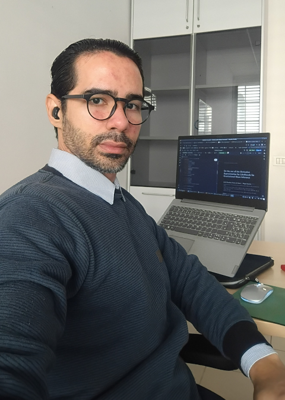

=================================  
About the Author
=================================

* **Dr. Josiel Mendonça Soares de Souza**
	* PostDoc in Physics
	* `PPGCosmo <https://ppgcosmo.github.io/>`_, Universidade Federal do Espírito Santo, ES, Brazil 
	* Research Field: Gravitation, Cosmology and Gravitational Waves
	* Member of `Brazilian Einstein Telescope Synergy (BETS) <https://b-e-t-s.github.io/>`_
	* Member of `Einstein Telescope Observational Science Board (ET-OSB) <https://einsteintelescope.eu/>`_
	* Member of `Cosmic Explorer Consortium <https://cosmicexplorer.org/consortium.html>`_
	* `PhD Thesis (DFTE-UFRN, Brazil) <https://repositorio.ufrn.br/items/555096fe-221c-4899-83b4-45378abf5fd6>`_
	* `github profile  <https://github.com/jmsdsouzaPhD>`_
	* `ORCID <https://orcid.org/0000-0003-1552-0095>`_
	* `Curriculum Vitae <https://github.com/jmsdsouzaPhD/jmsdsouzaPhD/blob/main/Josiel%20Mendonca%20CV.pdf>`_

Collaborators:

* **Prof. Riccardo Sturani**
	* Instituto de Física Teórica (IFT, ICTP-SAIFR), Universidade Estadual Paulista (UNESP), São Paulo, Brazil

* **Prof. Miguel Quartin**
	* Centro Brasileiro de Pesquisas Físicas (CBPF), Rio de Janeiro, RJ, Brazil