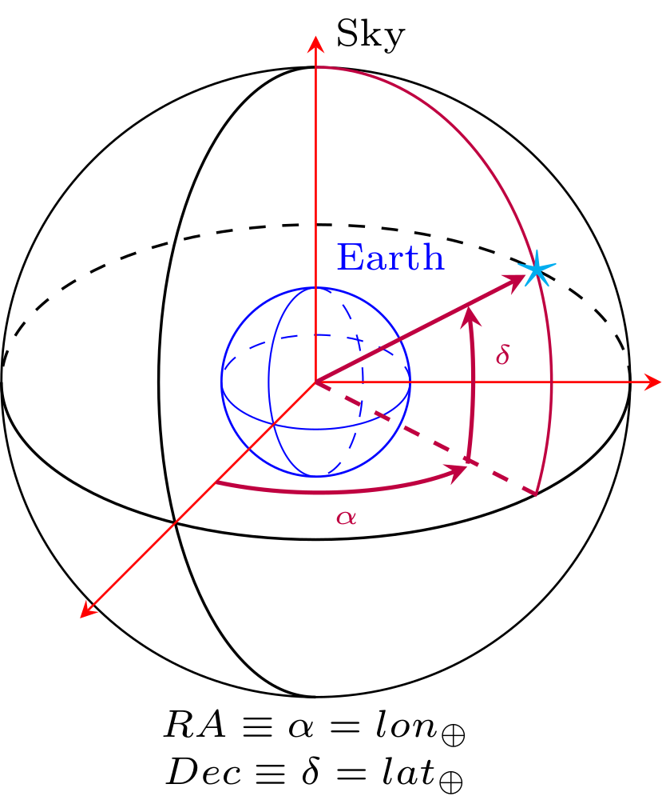

=================================  
GW Sources Characterization
=================================

************************************
   Sky Localization
************************************

In GWDALI we deal with astronomical coordinates (RA, Dec) aligned with geocentric coordinates (longitude 'lon' and latitude 'lat' ) such that :math:`Ra//lon` and :math:`Dec//lat`:

************************************
   Free Parameters
************************************

   * Mass Parameterizations:
      * m1: **Redshifted  Mass of the first object** :math:`\longrightarrow (1+z)m_1` [:math:`M_{\odot}`]
      * m2: **Redshifted  Mass of the second object** :math:`\longrightarrow (1+z)m_2` [:math:`M_{\odot}`]
      * eta: **Symetric mass ratio** :math:`\longrightarrow \eta \equiv m_1m_2/(m_1+m_2)^2`
      * Mc: **Redshifted Chirp Mass** :math:`\longrightarrow \mathcal{M}_c \equiv (1+z)M_c \equiv (1+z)\eta^{3/5}(m_1+m_2)` [:math:`M_{\odot}`]
      * M: **Redshifted Total Mass** :math:`\longrightarrow \mathcal{M} \equiv (1+z)(m_1+m_2)` [:math:`M_{\odot}`]
      * q: **Mass Ratio** :math:`\longrightarrow q=m_2/m_1` with :math:`m_1>m_2`
      * inv_eta: **Inverse of Symetric mass ratio** :math:`\longrightarrow \eta^{-1}`
      * ln_Mc: **Logarithm of Redshifted Chirp Mass** :math:`\longrightarrow ln((1+z)M_c/M_{\odot})`
      * ln_eta: **Logarithm of Symetric mass ratio** :math:`\longrightarrow ln(\eta)`
      * deltaM: **Dimensionless Mass Difference** :math:`\longrightarrow \delta_M = (m_1 - m_2)/M`
   
   * Distance Parameterizations:
      * dL: **Luminosity Distance** :math:`\longrightarrow d_L` [Gpc]
      * inv_dL: **Inverse of Luminosity Distance** :math:`\longrightarrow d_L^{-1}` [:math:`Gpc^{-1}`]
      * inv_dL2: **Inverse of squared Luminosity Distance** :math:`\longrightarrow d_L^{-2}` [:math:`Gpc^{-2}`]
      * inv_sqrtdL: **Inverse of square root of Luminosity Distance** :math:`\longrightarrow d_L^{-1/2}` [:math:`Gpc^{-1/2}`]
      * lnDL: **Logarithm of Luminosity Distance** :math:`\longrightarrow ln(d_L/Gpc)`
      * inv_lnDL: **Inverse of Logarithm of Luminosity Distance** :math:`\longrightarrow 1/ln(d_L/Gpc)`

   * Inclination Parameterizations:
      * iota: **Inclination** :math:`\longrightarrow \iota` [rad]
      * cos_iota: **Cosine of Inclination** :math:`\longrightarrow \cos(\iota)`
   
   * Spins Parameterizations:
      - Cartesian Coordinates:
         * sx1: **X-Component of First Object Spin** :math:`\longrightarrow S_{x_1}`
         * sy1: **Y-Component of First Object Spin** :math:`\longrightarrow S_{y_1}`
         * sz1: **Z-Component of First Object Spin** :math:`\longrightarrow S_{z_1}`
         * sx2: **X-Component of Second Object Spin** :math:`\longrightarrow S_{x_2}`
         * sy2: **Y-Component of Second Object Spin** :math:`\longrightarrow S_{y_2}`
         * sz2: **Z-Component of Second Object Spin** :math:`\longrightarrow S_{z_2}`
   
      - Spherical Coordinates:
         * chi1: **Magnitude of the First Object Spin** :math:`\longrightarrow \chi_1 \equiv |\vec{S}_1|`
         * theta1: **Polar Angle of the First Object Spin** :math:`\longrightarrow \theta_1` [rad]
         * phi1: **Azimuthal Angle of the First Object Spin** :math:`\longrightarrow \phi_1` [rad]
         * chi2: **Magnitude of the Second Object Spin** :math:`\longrightarrow \chi_2 \equiv |\vec{S}_2|`
         * theta2: **Polar Angle of the Second Object Spin** :math:`\longrightarrow \theta_2` [rad]
         * phi2: **Azimuthal Angle of the Second Object Spin** :math:`\longrightarrow \phi_2` [rad]
      
      - Symmetric/Antisymmetric Spins:
         * chi\_s: **Symmetric Spin** :math:`\longrightarrow \chi_s = (\chi_1 + \chi_2)/2`
         * chi\_a: **Antisymmetric Spin** :math:`\longrightarrow \chi_a = (\chi_1 - \chi_2)/2`
   
   * RA: **Right Ascencion** :math:`\longrightarrow Ra` [deg]
   * Dec: **Declination** :math:`\longrightarrow Dec` [deg]
   * psi: **Polarization Angle** :math:`\longrightarrow \psi` [rad]
   * phi\_coal: **Coalescence Phase** :math:`\longrightarrow \phi_{coal}` [rad]
   * t\_coal: **Coalescence Time** :math:`\longrightarrow t_{coal}` [seconds]
   
   

