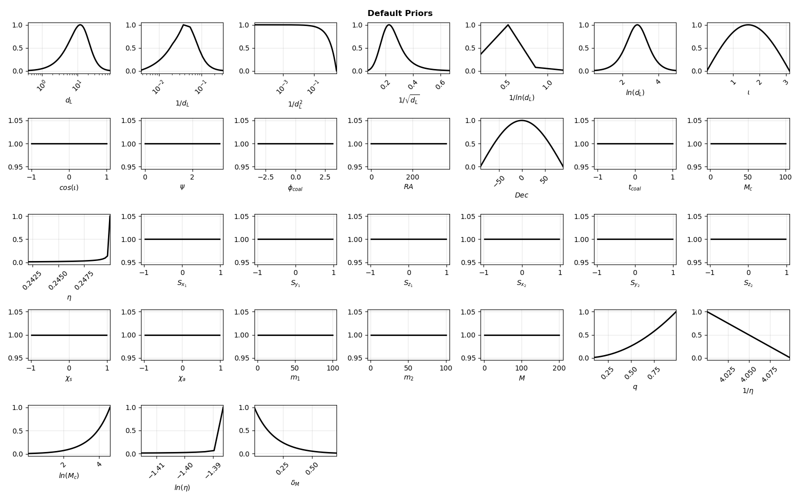
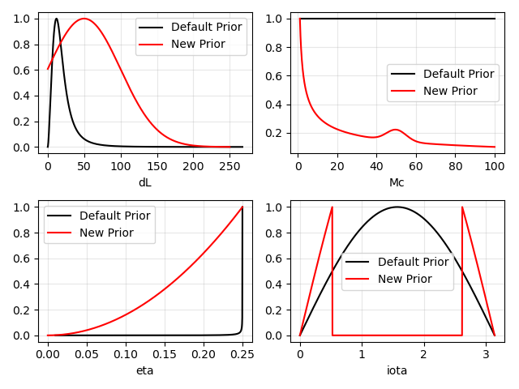

Priors
=================================

************************************  
Default Priors
************************************

+----------------------+-------------------------------+------------------------------+--------------------------------------------------------------------+
| Parameter            | Support / Integration Limits  | Prior Type                   | Analytical Form                                                    |
+======================+===============================+==============================+====================================================================+
| ``m1``               | ``[1,100]``                   | Uniform                      | :math:`p(m_1)\propto 1`                                            |
+----------------------+-------------------------------+------------------------------+--------------------------------------------------------------------+
| ``m2``               | ``[1,100]``                   | Uniform                      | :math:`p(m_2)\propto 1`                                            |
+----------------------+-------------------------------+------------------------------+--------------------------------------------------------------------+
| ``M``                | ``[1,200]``                   | Uniform                      | :math:`p(M)\propto 1`                                              |
+----------------------+-------------------------------+------------------------------+--------------------------------------------------------------------+
| ``Mc``               | ``[1,100]``                   | Uniform                      | :math:`p(\mathcal{M}_c)\propto 1`                                  |
+----------------------+-------------------------------+------------------------------+--------------------------------------------------------------------+
| ``ln_Mc``            | ``[\ln 1,\ln 100]``           | Log-chirp-mass prior         | :math:`p(\ln\mathcal{M}_c)\propto e^{\ln\mathcal{M}_c}`            |
+----------------------+-------------------------------+------------------------------+--------------------------------------------------------------------+
| ``q``                | ``[10^{-2},1-\epsilon]``      | Mass-ratio prior             | :math:`p(q)\propto q^2`                                            |
+----------------------+-------------------------------+------------------------------+--------------------------------------------------------------------+
| ``eta``              | derived from ``q``            | Derived prior                | Derived from the prior on ``q``                                    |
+----------------------+-------------------------------+------------------------------+--------------------------------------------------------------------+
| ``inv_eta``          | derived from ``eta``          | Derived prior                | Derived from the prior on ``eta``                                  |
+----------------------+-------------------------------+------------------------------+--------------------------------------------------------------------+
| ``ln_eta``           | derived from ``eta``          | Derived prior                | Derived from the prior on ``eta``                                  |
+----------------------+-------------------------------+------------------------------+--------------------------------------------------------------------+
| ``deltaM``           | derived from ``eta``          | Derived prior                | Derived from the prior on ``eta``                                  |
+----------------------+-------------------------------+------------------------------+--------------------------------------------------------------------+
| ``RA``               | ``[0,360^\circ]``             | Uniform                      | :math:`p(\alpha)\propto 1`                                         |
+----------------------+-------------------------------+------------------------------+--------------------------------------------------------------------+
| ``Dec``              | ``[-90^\circ,90^\circ]``      | Isotropic sky prior          | :math:`p(\delta)\propto \cos\delta`                                |
+----------------------+-------------------------------+------------------------------+--------------------------------------------------------------------+
| ``iota``             | ``[0,\pi]``                   | Sine prior                   | :math:`p(\iota)\propto \sin\iota`                                  |
+----------------------+-------------------------------+------------------------------+--------------------------------------------------------------------+
| ``cos_iota``         | ``[-1,1]``                    | Uniform                      | :math:`p(\cos\iota)\propto 1`                                      |
+----------------------+-------------------------------+------------------------------+--------------------------------------------------------------------+
| ``psi``              | ``[0,\pi]``                   | Uniform                      | :math:`p(\psi)\propto 1`                                           |
+----------------------+-------------------------------+------------------------------+--------------------------------------------------------------------+
| ``t_coal``           | ``[-1,1]``                    | Uniform                      | :math:`p(t_{\rm coal})\propto 1`                                   |
+----------------------+-------------------------------+------------------------------+--------------------------------------------------------------------+
| ``phi_coal``         | ``[-\pi,\pi]``                | Uniform                      | :math:`p(\phi_{\rm coal})\propto 1`                                |
+----------------------+-------------------------------+------------------------------+--------------------------------------------------------------------+
| ``sx1,sy1,sz1``      | ``[-0.98,0.98]``              | Uniform                      | :math:`p(s_i)\propto 1`                                            |
+----------------------+-------------------------------+------------------------------+--------------------------------------------------------------------+
| ``sx2,sy2,sz2``      | ``[-0.98,0.98]``              | Uniform                      | :math:`p(s_i)\propto 1`                                            |
+----------------------+-------------------------------+------------------------------+--------------------------------------------------------------------+
| ``chi1``             | ``[0,0.98]``                  | Uniform                      | :math:`p(\chi_1)\propto 1`                                         |
+----------------------+-------------------------------+------------------------------+--------------------------------------------------------------------+
| ``phi1``             | ``[0,2\pi]``                  | Uniform                      | :math:`p(\phi_1)\propto 1`                                         |
+----------------------+-------------------------------+------------------------------+--------------------------------------------------------------------+
| ``theta1``           | ``[0,\pi]``                   | Spherical-angle prior        | :math:`p(\theta_1)\propto \sin\theta_1`                            |
+----------------------+-------------------------------+------------------------------+--------------------------------------------------------------------+
| ``chi2``             | ``[0,0.98]``                  | Uniform                      | :math:`p(\chi_2)\propto 1`                                         |
+----------------------+-------------------------------+------------------------------+--------------------------------------------------------------------+
| ``phi2``             | ``[0,2\pi]``                  | Uniform                      | :math:`p(\phi_2)\propto 1`                                         |
+----------------------+-------------------------------+------------------------------+--------------------------------------------------------------------+
| ``theta2``           | ``[0,\pi]``                   | Spherical-angle prior        | :math:`p(\theta_2)\propto \sin\theta_2`                            |
+----------------------+-------------------------------+------------------------------+--------------------------------------------------------------------+
| ``chi_s``            | ``[-0.98,0.98]``              | Uniform                      | :math:`p(\chi_s)\propto 1`                                         |
+----------------------+-------------------------------+------------------------------+--------------------------------------------------------------------+
| ``chi_a``            | ``[-0.98,0.98]``              | Uniform                      | :math:`p(\chi_a)\propto 1`                                         |
+----------------------+-------------------------------+------------------------------+--------------------------------------------------------------------+
| ``dL``               | cosmology-dependent           | Astrophysical distance prior | :math:`p(d_L)\propto \frac{dV_c}{dd_L}\frac{\mathrm{SFR}(z)}{1+z}` |
+----------------------+-------------------------------+------------------------------+--------------------------------------------------------------------+
| ``lnDL``             | derived from ``dL``           | Derived prior                | Derived from the prior on ``dL``                                   |
+----------------------+-------------------------------+------------------------------+--------------------------------------------------------------------+
| ``inv_dL``           | derived from ``dL``           | Derived prior                | Derived from the prior on ``dL``                                   |
+----------------------+-------------------------------+------------------------------+--------------------------------------------------------------------+
| ``inv_dL2``          | derived from ``dL``           | Derived prior                | Derived from the prior on ``dL``                                   |
+----------------------+-------------------------------+------------------------------+--------------------------------------------------------------------+
| ``inv_sqrtdL``       | derived from ``dL``           | Derived prior                | Derived from the prior on ``dL``                                   |
+----------------------+-------------------------------+------------------------------+--------------------------------------------------------------------+
| ``inv_lnDL``         | derived from ``dL``           | Derived prior                | Derived from the prior on ``dL``                                   |
+----------------------+-------------------------------+------------------------------+--------------------------------------------------------------------+

************************************  
Make your own prior
************************************

To redefine your priors define a dictionary with two arrays for each parameter, one for the support and another for the probability distribution. 
For instance, to redefine the priors on ``dL``, ``iota``, ``Mc`` and ``eta`` as shown in the figure below, we can run the code snippet below.

.. code:: python

	import numpy as np
	import GWDALI as gw
	import matplotlib.pyplot as plt

	FreeParams = "dL,Mc,eta,iota".split(',')

	Priors_default = gw.Priors(FreeParams,name=None,new_priors=None,plot=False)

	dL   = np.linspace(.1,250,1000)
	iota = np.linspace(0,np.pi,1000)
	Mc   = np.linspace(1,100,1000)
	eta  = np.linspace(0.0,0.25,1000)

	l0 = np.pi/6

	p_dL = np.exp(-.5*(dL-50)**2/50**2) ; p_dL/=sum(p_dL)
	p_Mc = Mc**(-.5)+np.exp(-0.5*((Mc-50)/5)**2)/np.sqrt(2*np.pi*5**2) ; p_Mc/=sum(p_Mc)
	p_eta = eta**2 ; p_eta/=sum(p_eta)
	p_iota = np.sin(iota)*(iota<l0)+np.sin(iota)*(iota>np.pi-l0) ; p_iota/=sum(p_iota)

	new_priors = {}
	new_priors["dL"] = [dL,p_dL]
	new_priors["iota"] = [iota,p_iota]
	new_priors["Mc"] = [Mc,p_Mc]
	new_priors["eta"] = [eta,p_eta]

	Priors_modified = gw.Priors(FreeParams,new_priors=new_priors,plot=False)

	for key in FreeParams:
		p1 = Priors_default[key]
		p2 = Priors_modified[key]

		x1 = np.linspace(p1.minimum,p1.maximum,1000)
		x2 = np.linspace(p2.minimum,p2.maximum,1000)
		y1 = p1.prob(x1) ; y1/=max(y1)
		y2 = p2.prob(x2) ; y2/=max(y2)

		plt.subplot(2,2,FreeParams.index(key)+1)
		plt.plot(x1,y1,'k-',label="Default Prior")
		plt.plot(x2,y2,'r-',label="New Prior")
		plt.xlabel(key)
		plt.legend()
		plt.grid(alpha=.3)

	plt.tight_layout()
	plt.show()

